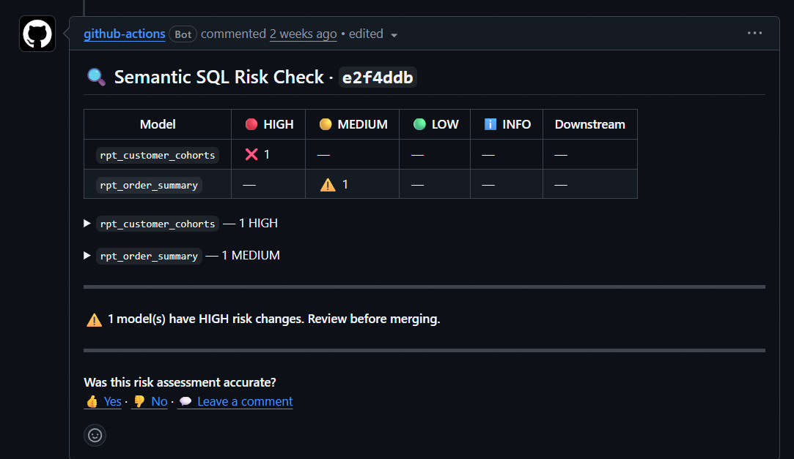

# Semantic Risk Engine

**Catch breaking SQL changes before they merge.**

A GitHub Action for dbt projects. When a pull request changes a model's SQL, it reads the
*meaning* of the change — not the text diff — and posts a comment classifying the risk:
**HIGH / MEDIUM / LOW / INFO**. In under a minute, with no warehouse access.



## Why

A text diff can't tell you that `LEFT JOIN → INNER JOIN` silently drops rows, or that a
changed `GROUP BY` quietly altered a metric's grain, or that a dropped `WHERE` expanded
your dataset. The pipeline runs green; the numbers just become wrong. This Action reads the
SQL structurally and flags the changes that actually change your results.

## What makes it different

- **Deterministic.** Same diff → same verdict, every time. Safe to gate a merge on —
  unlike an LLM reviewer. The full [classification rules](./RULES.md) are public: you know
  in advance what gets flagged, and as what.
- **No warehouse.** Pure static analysis. No credentials, no query execution, no customer
  data. The only thing that leaves your CI is the compiled SQL text, sent over TLS to our
  API. (Self-hosted option is on the roadmap.)
- **Graded, not binary.** An opinionated HIGH/MED/LOW/INFO call — plus business-criticality
  weighting: tag your revenue models and changes to them are flagged first, with the
  downstream blast radius listed.
- **Quiet by design.** Reformatting, comments, column reordering, consistent alias renames —
  no events. Zero false positives in benchmark testing. Alert fatigue is what gets a CI
  check turned off.

## Quick start

```yaml
# .github/workflows/semantic-risk.yml
name: Semantic Risk
on: pull_request
permissions:
  contents: read
  pull-requests: write   # required — the action posts the verdict as a PR comment
jobs:
  risk:
    runs-on: ubuntu-latest
    steps:
      - uses: actions/checkout@v4
        with:
          fetch-depth: 0        # required — the action diffs against the PR's base branch

      - uses: actions/setup-python@v5
        with:
          python-version: '3.12'

      - run: pip install dbt-snowflake   # swap for your warehouse adapter

      - uses: badaadata/semantic-risk-engine-action@v1
        continue-on-error: true   # shadow mode — an API hiccup must never fail your build
        with:
          api_key: ${{ secrets.SEMANTIC_RISK_API_KEY }}
        env:
          # your existing warehouse credentials — stay on your runner, never sent to our API
          DBT_SNOWFLAKE_ACCOUNT:   ${{ secrets.SNOWFLAKE_ACCOUNT }}
          DBT_SNOWFLAKE_USER:      ${{ secrets.SNOWFLAKE_USER }}
          DBT_SNOWFLAKE_PASSWORD:  ${{ secrets.SNOWFLAKE_PASSWORD }}
          DBT_SNOWFLAKE_DATABASE:  ${{ secrets.SNOWFLAKE_DATABASE }}
          DBT_SNOWFLAKE_WAREHOUSE: ${{ secrets.SNOWFLAKE_WAREHOUSE }}
          DBT_SNOWFLAKE_SCHEMA:    ${{ secrets.SNOWFLAKE_SCHEMA }}
```

1. Add the workflow file above to your dbt repo.
2. Add your API key as a repo secret named `SEMANTIC_RISK_API_KEY`
   (Settings → Secrets and variables → Actions).
3. Open a PR that changes a model — the risk comment appears.

**Prerequisite:** a working `dbt compile` in CI — the same setup your existing dbt jobs use.
The action needs `fetch-depth: 0` on checkout (it diffs against the PR's base branch) and
dbt installed on the runner before it runs.

**Do not mark this check as required during beta.** Shadow mode means it comments and never
gates — keep `continue-on-error: true` so an API outage can't block your merges.

## Get an API key

We're in **private beta** — free, ~15-minute white-glove setup, and we wire it up with you.
What we ask in return: run it on real PRs and tell us every verdict we get wrong.

**→ info@badaadata.com** (subject: "Semantic Risk Engine beta")

Open-source dbt projects (public repos): free forever — same address.

## What it catches

Joins (type, direction, condition, key) · filters incl. boolean predicates (`WHERE NOT
is_deleted`) · `GROUP BY` grain incl. ROLLUP/CUBE · aggregations · columns (added, removed,
expression, lineage) · window functions and `QUALIFY` · CTEs, nested to any depth · scalar
subqueries · `UNION`/`INTERSECT`/`EXCEPT` · `EXISTS` and `IN (subquery)` predicates.

Validated: 16/16 injected breaking-change classes caught across two real dbt packages
(Fivetran's Stripe + Salesforce), 0 false positives, 1,200+ automated tests. Known limits
are documented honestly in the [rules reference](./RULES.md) — e.g. `LATERAL FLATTEN`
input changes are a current gap.

## Mark your critical models (optional)

```yaml
# in a model's schema.yml
models:
  - name: fct_revenue
    config:
      meta:
        semantic_risk_critical: true
```

Changes to tagged models are sorted first, marked 🔴, and the downstream models affected
are listed in the comment.

## Troubleshooting

- **403 posting the comment** — your org defaults `GITHUB_TOKEN` to read-only. Add the
  `permissions:` block from the example above.
- **"dbt compile failed"** — the action reuses your CI's dbt setup; if your existing dbt
  jobs can't compile on this runner, fix that first.
- **What's in the request?** Exactly: model name, old compiled SQL, new compiled SQL,
  dialect, and the PR reference — nothing else. One honest caveat: if your model SQL calls
  `env_var()` directly, the *compiled* SQL will contain those resolved values, like any
  system that reads compiled dbt output. Keep secrets out of model logic (standard dbt
  practice) and nothing sensitive can appear.

## What it does NOT do

It analyzes SQL structure, not your data — it tells you a change *could* alter results,
not that the numbers *did* change. GitHub + dbt only for now. During beta it runs in
shadow mode: it comments, it never blocks a merge.

## Risk levels at a glance

| Level | Meaning | Example |
|-------|---------|---------|
| HIGH | Result set / business meaning likely changes | `LEFT→INNER` join, dropped filter, grain change |
| MEDIUM | Output values or schema may change | `SUM→COUNT`, filter threshold, column removed |
| LOW | Minor / structural change | new aggregation added |
| INFO | No semantic impact | column reorder, reformat, comments |

Full rulebook: [RULES.md](./RULES.md).

## License

[MIT](./LICENSE) — this repository (the Action client). The analysis engine itself is a
hosted service and is not part of this repository.

---

*Built by [Badaa Data](https://www.badaadata.com). Questions, wrong verdicts, feature
requests: info@badaadata.com — we read every one.*
